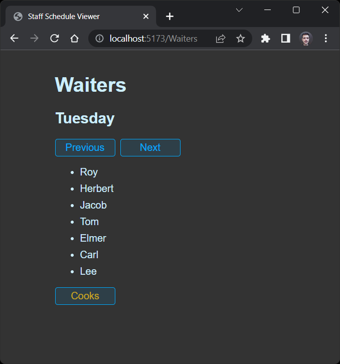

# Staff Schedule Viewer

Full stack app to visualize staff schedule on weekdays

## Requirements

- Node.js
- Docker

## Database - MongoDB

This project uses MongoDB as the database, running locally as a Docker container.

Provided you have Docker installed, run the following code in a terminal to spin up MongoDB:

- `docker pull mongodb/mongodb-community-server`

- `docker run --name mongo -p 27017:27017 -d mongodb/mongodb-community-server:latest`

Since it's a test application running in localhost, no authentication was configured.

## Backend - Fastify (Node.js)

This project uses Fastify as the backend, loading initial seed data from JSON files to the database on startup.

To start the API, open a terminal, navigate to the _backend_ folder and run the following command:

- `npm i && npm start`

At this point, you should console messages confirming the server is up and running:

> _"Server listening at http://127.0.0.1:3000"_ / _"Connected to MongoDB database"_ / _"Seed data uploaded successfully"_

Two endpoints are exposed for data fetch: /GetCooks and /GetWaiters. You can check them at the URLs below:

- http://localhost:3000/GetCooks

- http://localhost:3000/GetWaiters

## Frontend - React

This project uses React as the frontend, fetching data from the API and displaying a list of employees working on each weekday. Previous and Next buttons are available to change the weekday, ranging from Monday to Friday. Another button at the bottom toggles the employee type to be displayed.

To start the application, navigate to the _frontend_ folder and run the following command:

- `npm i && npm run dev`

Now click the following link to open the app:

- http://localhost:5173/Cooks

Screenshot:

